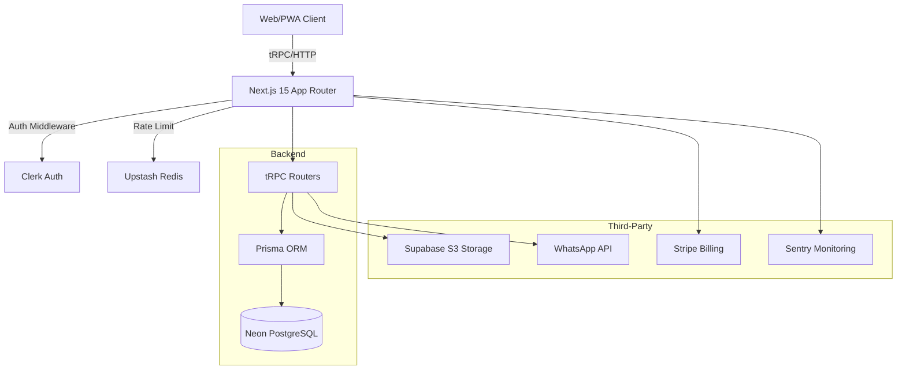

<p align="center">
  
</p>

<h1 align="center">Autevo</h1>

<p align="center">
  <strong>High-Performance SaaS for Automotive Service Management</strong><br />
  <em>Enterprise-grade multi-tenant architecture for detailing centers, workshops, and mechanical shops.</em>
</p>

<p align="center">
  
  
  
  
  
  
  
</p>

---

## 📋 Table of Contents

- [Core Objective](#-core-objective)
- [Architecture & Tech Stack](#-architecture--tech-stack)
- [Key Features](#-key-features)
- [System Visualization](#-system-visualization)
- [Project Anatomy](#-project-anatomy)
- [Getting Started](#-getting-started)
- [Security & Resilience](#-security--resilience)
- [Deployment](#-deployment)

---

## 🚀 Core Objective

**Autevo** is a robust SaaS platform designed to solve the complexity of automotive business operations. It provides a mission-critical infrastructure for managing service orders, customer lifecycles, and financial health with a focus on visual evidence (digital inspections) and automated communication.

### Why Autevo?

- 🏢 **Strict Multi-tenancy** — Zero data leakage between tenants via Prisma-level isolation and Clerk organization metadata.
- 📱 **Mobile-First PWA** — Native-like experience with offline capabilities for technicians in the shop.
- 🛡️ **Audit-Ready** — Comprehensive logging of critical actions for security and accountability.
- 📈 **Growth-Driven** — Built-in referral and partnership systems to accelerate tenant acquisition.

---

## 🛠️ Architecture & Tech Stack

### Engineering Choices

- **Type-Safety**: End-to-end type safety using **tRPC v11**, ensuring API changes never break the frontend without a compiler error.
- **Serverless Database**: **Neon (PostgreSQL)** for branching and instant scaling, coupled with **Prisma 6**.
- **Edge Computing**: Middleware-based routing and protection, leveraging **Next.js 15** App Router.
- **Resilience**: Rate limiting via **Upstash Redis** and error tracking with **Sentry**.

### Component Layers

- **Frontend**: React 19, Tailwind CSS, Radix UI (accessible primitives), Framer Motion.
- **Auth**: Clerk (Multi-tenant management + Social SSO).
- **Storage**: Supabase Storage (Optimized image handling for inspections).
- **Billing**: Stripe (Subscription lifecycle + Webhook state machine).

---

## 📊 System Visualization



---

## 📁 Project Anatomy

```text
autevo/
├── apps/
│   └── web/                    # Next.js Application Core
│       ├── src/
│       │   ├── app/            # App Router (Pages, Layouts, API)
│       │   │   ├── admin/      # SaaS-wide administration (Admin only)
│       │   │   ├── dashboard/  # Tenant management area (Authenticated)
│       │   │   ├── booking/    # Public scheduling endpoint
│       │   │   └── tracking/   # Public OS tracking (No login)
│       │   ├── server/         # Backend Logic (tRPC Procedures)
│       │   ├── components/     # UI/Shared Design System
│       │   └── lib/            # Business Logic & Helpers
│
├── packages/
│   └── database/               # Shared Database Layer
│       └── prisma/
│           └── schema.prisma   # Single Source of Truth for Schema
│
├── docs/                       # Technical Deep-dives
├── turbo.json                  # Turborepo Build Cache Config
└── pnpm-workspace.yaml         # Monorepo Dependency Orchestration
```

---

## 📋 Prerequisites

- **Node.js**: `^20.x`
- **pnpm**: `^10.x`
- **Docker**: For local database development.

---

## 🚀 Getting Started

### 1. Environment Setup

Copy example environment files to both application and database packages.

```bash
# Root
cp apps/web/.env.example apps/web/.env.local
cp packages/database/.env.example packages/database/.env
```

### 2. Dependency Installation

```bash
pnpm install
```

### 3. Database Bootstrap

```bash
docker-compose up -d
pnpm db:push
```

### 4. Development Loop

```bash
pnpm dev
```

The system will be accessible at `http://localhost:3000`.

---

## 🔐 Security & Resilience

- **Data Isolation**: Every SQL query is filtered by `tenantId` extracted from the session token.
- **Encryption**: Sensitive customer data and PII are handled with care; specific fields use server-side encryption salts.
- **Resilience**:
  - **Upstash Redis** enforces a 50 req/min rate limit on sensitive routes.
  - **Atomic Transactions**: Complex OS updates use Prisma `$transaction` to ensure data integrity.

---

## 🌐 Deployment

Autevo is optimized for **Vercel**.

1. **Root Directory**: `.` (Monorepo root)
2. **Build Command**: `pnpm build`
3. **Install Command**: `pnpm install`

Ensure all environment variables from `apps/web/.env.local` are mirrored in the Vercel dashboard.

---

<p align="center">
  Proprietary Software — All Rights Reserved.<br />
  <strong>Developed with precision by the Autevo Engineering Team.</strong>
</p>
