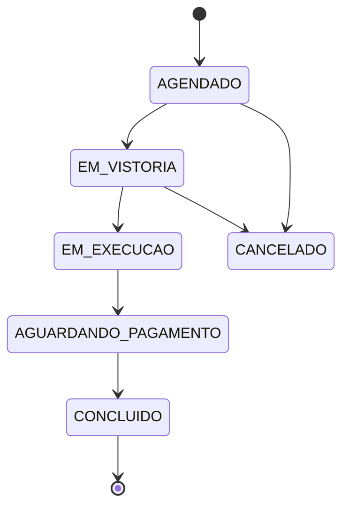

# 📋 Autevo System Features

> **Last Update:** February 12, 2026  
> **Version:** 1.2.0 (Next.js 15 Ready)

---

## 🏗️ System Architecture

| Component            | Technology                                          |
| -------------------- | --------------------------------------------------- |
| **Frontend**         | Next.js 15.1 (App Router), React 19, TypeScript 5.7 |
| **Backend**          | tRPC v11 (20+ domain routers), Prisma 6             |
| **Database**         | PostgreSQL (Neon / Docker)                          |
| **Authentication**   | Clerk (Multi-tenant with publicMetadata & JWT)      |
| **Storage**          | Supabase S3 Storage                                 |
| **Cache/Rate Limit** | Upstash Redis (Edge compatible)                     |
| **Monitoring**       | Sentry / Vercel Analytics                           |
| **UI System**        | shadcn/ui, Tailwind CSS 3.4, Framer Motion          |

---

## 🏢 Multi-Tenancy & Lifecycle

### Tenant Management

- **Signup Workflow**: Instant tenant creation with `PENDING_ACTIVATION` status.
- **Founding Member Program**: First 15 members get 60 days trial and special pricing (R$ 97).
- **Status Machine**: `PENDING` → `TRIAL` → `ACTIVE` / `PAST_DUE` / `SUSPENDED` / `CANCELED`.
- **Custom Branding**: Tenant-specific primary/secondary colors and logos applied globally via `TenantThemeProvider`.
- **Dynamic Configuration**: Business hours (JSON), max daily capacity, and digital signature requirements.

### Inactivity Management (Smart Retention)

- **Automatic Tracking**: Monitors customer engagement intervals.
- **Configurable Thresholds**: Each tenant defines `customerInactivityDays`.
- **Proactive Reminders**: Automated follow-up triggers when a customer crosses the inactivity threshold.

---

## 🤝 Partnership & Referral System

### Affiliate Infrastructure

- **Partner Codes**: Unique codes (e.g., `FILMTECH`) for tracking origin.
- **Tiered Commissions**: Strategic partnership tracking with automated commission calculation (e.g., 30% recurring).
- **Referral Lifecycle**: `PENDING` → `ACTIVE` (after first payment) → `CHURNED`.
- **Promo Codes**: Integrated discount codes applied at subscription, with configurable duration (e.g., 15% for 3 months).

---

## 📋 Service Order (OS) Engine

### Lifecycle & Status

### Advanced Functionalities

- **Sequential OS Codes**: Unique tracking ID per tenant.
- **Itemized Billing**: Granular services and products vinculation with real-time total calculation.
- **Automatic Load Balancing**: Booking system assigns orders to staff based on current workload.
- **Internal/External Communications**: Automated WhatsApp messages with dynamic variables (`{{customer_name}}`, `{{order_id}}`).

---

## 🔍 Digital Inspection System (Vistoria)

- **Multi-stage Inspections**: `Entrada`, `Intermediária`, and `Final`.
- **Structured Checklist**: categorized by exterior, wheels, and fine details.
- **Avaria Mapping**: Visual registration of scratches, dents, or cracks with severity levels and timestamped photos.
- **Legal Compliance**: Digital signatures stored with signature channel (Client/Staff) and timestamp.

---

## 💰 Financial & Billing

- **Multi-Method Payments**: PIX, Credit, Debit, Cash.
- **Commission Split**: Automated calculation per item/service for technicians based on percentage or fixed fees.
- **Subscription Engine**:
  - Direct Stripe integration for recurring payments.
  - Webhook-driven state synchronization.
  - Support for `customMonthlyPrice` for enterprise/negotiated contracts.

---

## 📊 Analytics & Reporting

- **Principal Dashboard**: Real-time KPIs (Revenue, Ticket Médio, Pending Payments).
- **Admin SaaS Panel**: Global view of all tenants, MRR tracking, and system-wide audit logs.
- **Reporting Suite**: Exportable reports (CSV/Excel) for customers, services, and employee performance.

---

## 📱 Public Interfaces

- **Public Booking**: Client-facing portal for scheduling without registration, featuring capacity-aware availability.
- **Real-time Tracking**: Link provided to clients for following OS progress and viewing inspection photos in real-time.
- **PWA Capabilities**: Installable application icon, offline manifest, and push notifications for status updates.

---

## 🔐 Security & Governance

- **Role-Based Access (RBAC)**: `ADMIN_SAAS`, `OWNER`, `MANAGER`, `MEMBER`.
- **Audit Trails**: Detailed logs capturing `oldValue` vs `newValue` for critical entity mutations.
- **Rate Limiting**: Protection against brute-force and scraping via Upstash Redis.
- **Data Privacy**: Tenant-level isolation enforced at the Prisma query level.
