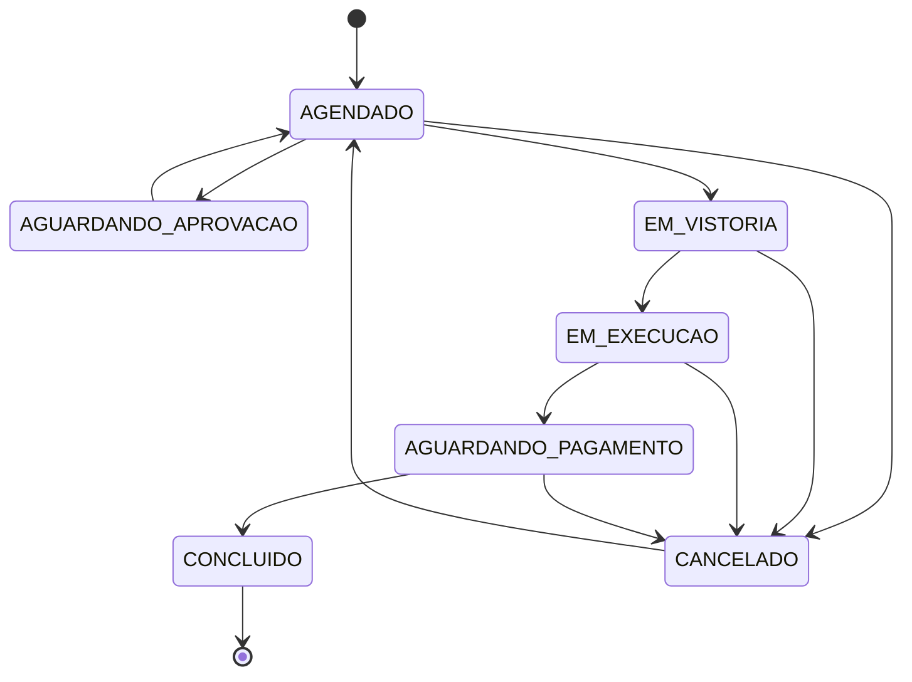

# 📋 Autevo — Features do Sistema

> **Última atualização:** Março 2026
> **Versão:** 1.4.0

---

## 🏗️ Arquitetura & Stack

| Componente | Tecnologia |
|-----------|------------|
| **Frontend** | Next.js 15.1 (App Router), React 19, TypeScript 5.7 |
| **Backend** | tRPC v11 (20+ routers), Prisma 6 |
| **Banco** | PostgreSQL 16 (Neon serverless / Docker local) |
| **Autenticação** | Clerk (multi-tenant, JWT com metadados customizados) |
| **Storage** | AWS S3 / Supabase Storage / Cloudflare R2 (S3-compatible) |
| **Cache/Rate Limit** | Upstash Redis (edge-compatible, sliding window) |
| **Billing** | Stripe (assinaturas + webhooks) |
| **Monitoramento** | Sentry + Vercel Analytics + Vercel Speed Insights |
| **UI** | shadcn/ui, Tailwind CSS 3.4, Radix UI, Framer Motion |
| **CI/CD** | GitHub Actions → Vercel |
| **Monorepo** | Turborepo 2.3 + pnpm workspaces |

---

## 🏢 Multi-Tenancy & Ciclo de Vida

### Gerenciamento de Tenant

- **Signup em 3 etapas:** Setup wizard com dados do negócio, configurações operacionais e personalização visual
- **Status Machine:** `PENDING_ACTIVATION` → `TRIAL` → `ACTIVE` / `PAST_DUE` / `SUSPENDED` / `CANCELED`
- **Programa Membro Fundador:** Primeiros 15 clientes com 60 dias de trial e preço especial (R$ 97 trial → R$ 140/mês)
- **Branding Customizado:** Cores primária/secundária e logo aplicados globalmente via CSS variables (`TenantThemeProvider`)
- **Configuração Dinâmica:** Horários de funcionamento (JSON), capacidade máxima diária, exigências de vistoria
- **ToS Versionado:** Registro de aceite com IP + versão; re-aceite obrigatório ao atualizar versão

### Gestão de Inatividade (Retenção)

- **Tracking Automático:** Monitora última OS concluída por cliente
- **Threshold Configurável:** Cada tenant define `customerInactivityDays`
- **Anti-spam:** Intervalo mínimo de 7 dias entre lembretes por cliente
- **Notificação:** Push notification para owners + log de notificação

---

## 🤝 Programa de Parceria & Indicação

### Infraestrutura de Afiliados

- **Partner Codes:** Código único por tenant (ex: `FILMTECH`)
- **Promo Codes:** Códigos de desconto com % e duração configurável (mensal: 1 mês / anual: 3 meses)
- **Comissão por Indicação:** 30% da mensalidade (R$ 42/mês por indicado ativo)
- **Mensalidade Grátis:** 5+ indicados ativos = plano gratuito para o parceiro
- **Lifecycle do Referral:** `PENDING` → `ACTIVE` (após 1º pagamento + 30 dias de carência) → `CHURNED`
- **Histórico de Comissões:** Paginado, com status PENDING / PAID / CANCELLED

---

## 📋 Motor de OS (Ordem de Serviço)

### Lifecycle e Status

### Funcionalidades

- **Códigos Sequenciais:** `OS-001`, `OS-002`... por tenant via `TenantSequence` atômico
- **Faturamento Itemizado:** Serviços e produtos com cálculo de total em tempo real
- **Desconto:** PERCENTAGE ou FIXED por OS
- **Aprovação do Cliente:** Token one-time com expiração para aprovação/rejeição sem login
- **Controle de Inventário:** Dedução automática de estoque ao concluir
- **Load Balancing:** Agendamento distribui por capacidade do técnico
- **Rastreamento Público:** Link para cliente sem login
- **WhatsApp:** Templates dinâmicos com variáveis por etapa da OS
- **Contrato Digital:** Template customizável com assinatura

---

## 🔍 Sistema de Vistorias Digitais

- **3 Tipos:** Entrada, Intermediária, Final (obrigatoriedade configurável por tenant)
- **Checklist Estruturado:** 14 itens obrigatórios (exterior, rodas, itens pessoais)
- **Múltiplas Fotos por Item:** Array de URLs por ponto do checklist
- **Clone de Vistoria:** Final herda fotos e dados da entrada
- **Avarias Livres:** Registro de danos fora do checklist (Arranhão, Amassado, Trinca, etc.)
- **Severidade:** Leve, Moderado, Grave
- **Assinatura Digital:** Canvas PNG → S3 (staff ou cliente via tracking)
- **Verificação por Telefone:** Assinatura pública valida 8+ dígitos do telefone
- **Vídeo Final:** URL de vídeo opcional na vistoria final
- **Offline:** Fotos capturadas offline são sincronizadas ao recuperar conexão
- **PDF:** Relatório completo com fotos, checklist e assinatura

---

## 💰 Financeiro e Billing

### Pagamentos de OS

- **Métodos:** PIX, Cartão de Crédito, Cartão de Débito, Dinheiro, Transferência
- **Pagamento Parcial:** Múltiplos pagamentos por OS
- **Recebível:** Cálculo automático de saldo devedor

### Comissões de Funcionários

- **Comissão por Item:** % ou valor fixo por serviço, configurável por técnico
- **Settlement:** Registro de pagamento de comissão com referência PIX
- **Status:** ACTIVE / CANCELLED / REVERSED

### Assinatura SaaS

- **Stripe integrado:** Checkout, portal de billing, webhooks state machine
- **Promo codes** com % e duração configuráveis
- **Preço founder** (R$ 140) e enterprise (customizado)
- **Cancelamento soft:** Acesso até fim do período

---

## 📊 Analytics & Relatórios

- **Dashboard Principal:** OS do dia, em andamento, receita do mês, pendentes
- **Financeiro (Manager+):** Receita, ticket médio, CMV, comissões, lucro, gráfico diário
- **Performance da Equipe:** ROI por técnico (receita gerada vs custo total)
- **Exportação:** CSV/Excel de pagamentos, OS e comissões com filtro de período
- **Admin SaaS:** MRR global, tenants por status, audit logs do sistema

---

## 📱 Interfaces Públicas

- **Agendamento:** `/booking/[slug]` — sem login, com verificação de capacidade
- **Rastreamento:** `/tracking/[orderId]` — status em tempo real + fotos da vistoria
- **Aprovação:** `/public/approve/[token]` — aprovar/rejeitar OS via token

---

## 🔐 Segurança & Governança

- **RBAC:** `ADMIN_SAAS`, `OWNER`, `MANAGER`, `MEMBER`
- **Isolamento Multi-tenant:** `tenantId` em 100% das queries Prisma
- **Rate Limiting:** 50 req/min sliding window via Upstash
- **Audit Trail:** `oldValue` + `newValue` em JSON em todas as mutações críticas
- **Criptografia:** AES-256-GCM para dados sensíveis (chave PIX)
- **Tokens One-time:** Aprovações públicas com expiração

---

## 📲 PWA & Notificações

- **PWA Instalável:** Manifest, ícones, service worker customizado
- **Offline:** Vistorias funcionam offline com sync automático posterior
- **Push Notifications (Web Push API):**
  - Nova OS criada → Owner/Manager
  - OS concluída → Owner/Manager
  - Atribuído a mim → Member
  - Clientes inativos → Owner/Manager (via cron)
- **Preferências granulares** por tipo de evento e role

---

## 📡 Comunicação WhatsApp

- **Links wa.me** sem API externa — zero custo
- **Templates customizáveis** por tenant com variáveis dinâmicas (`{nome}`, `{veiculo}`, `{link}`)
- **Templates padrão:** Tracking link, Serviço concluído, Lembrete de pagamento, Aniversário

---

## 📦 Gestão de Estoque

- **Catálogo de Produtos:** SKU, custo, venda, estoque atual e mínimo
- **Movimentações rastreadas:** ENTRADA / SAIDA_OS / AJUSTE
- **Alertas de baixo estoque**
- **Templates de serviço:** Produtos vinculados automaticamente ao adicionar serviço na OS
- **Snapshot de custo** na OS para CMV histórico preciso

---

## ⏰ Jobs Agendados (Crons)

| Job | Schedule | Descrição |
|-----|----------|-----------|
| Cleanup tokens | 02:00 UTC diário | Remove tokens de aprovação expirados |
| Clientes inativos | 09:00 UTC diário | Notifica owners sobre clientes sem retorno |
| Founder subscriptions | 00:00 UTC domingo | Atualiza preços de membros fundadores |
| Warmup | A cada 5 min | Mantém serverless aquecido |
